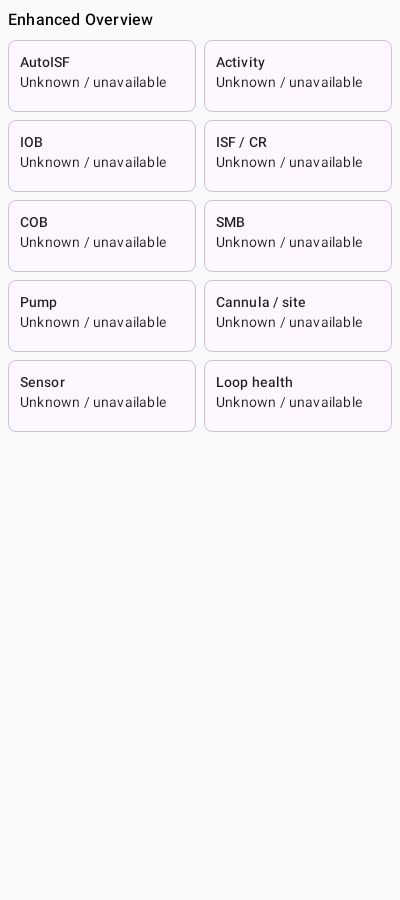
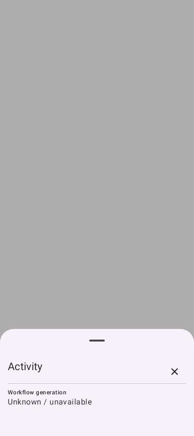
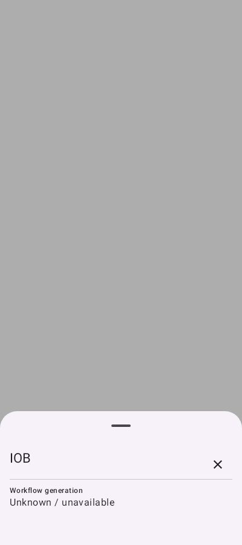
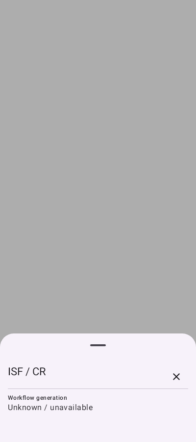
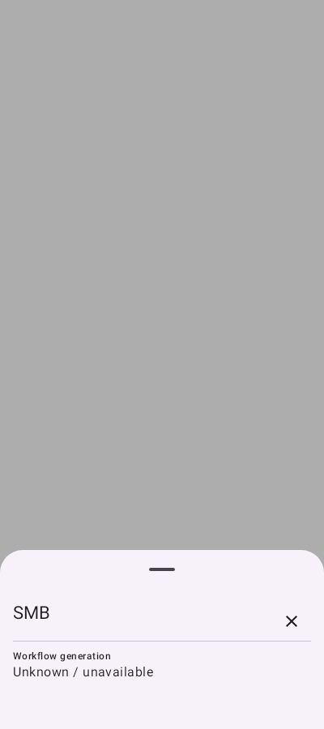
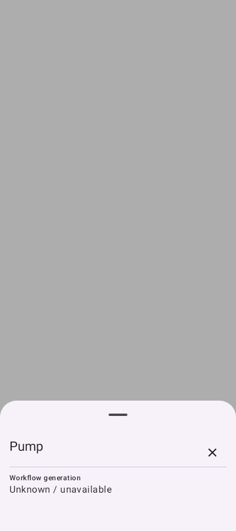
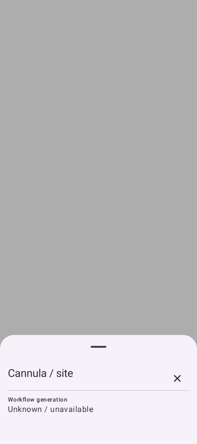
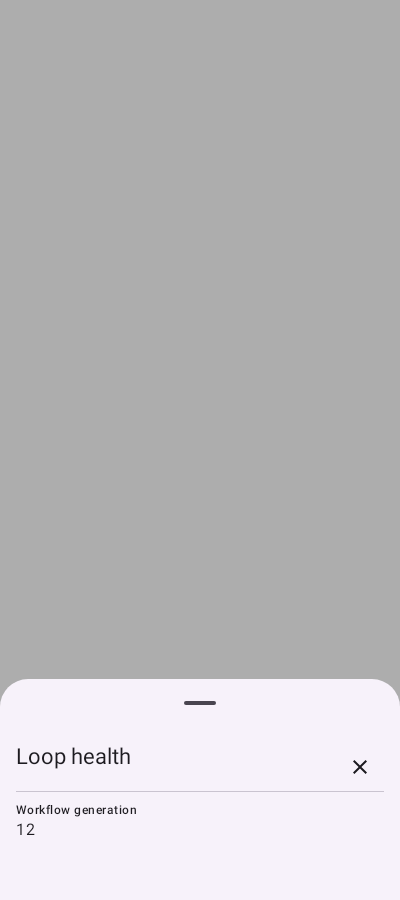
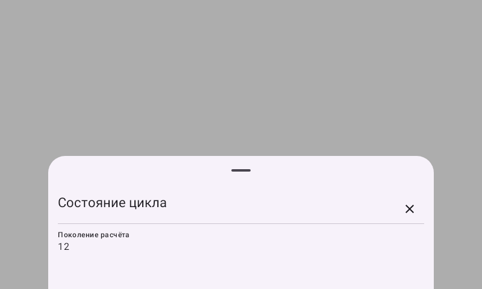

# AAPS 4.0 Apex7: отчёт о реализации

Дата: 11 сентября 2026 года.

Статус: **частично реализованный экспериментальный вариант**. Сборка и выбранные
автоматические тесты успешны, но испытаний с реальной помпой и клинической
валидации не было.

## Исходная база и результат

- Исходный commit: `a800bc11003d4dfeb327724380e00a22bb3dcac4`.
- Commit исходников собранного APK: `30f58c7572161a72d38029803b9da608ae12083c`.
- Ветка: `codex/apex7-reliability-overview`.
- Pull request: [LiveTuneR/AAPS #1](https://github.com/LiveTuneR/AAPS/pull/1).
- Успешная GitHub-сборка: [run 34617011164](https://github.com/LiveTuneR/AAPS/actions/runs/34617011164).
- APK: `aaps-4.0-apex-30f58c7.apk`, версия `4.0.0-beta-apex7`, versionCode `2006`.
- SHA-256: `8bc8e2459574f86fd3e2019711826e7ce205a291c23bac33ed66a91c714bbfb8`.
- Пакет: `info.nightscout.androidaps`, targetSdk 35.

Последующие commits содержат только исправление тестового захвата изображений и
этот отчёт. Они не входят в указанный APK.

## Что реализовано

### Расчёт Loop, Autosens и IOB/COB

- Завершённая MAIN-цепочка может передать в Loop новый фактический BG независимо
  от исходного флага `triggeredByNewBG`. Добавлена синхронизированная защита от
  повторной обработки одного BG.
- Публикация ссылки ADS проверяется и выполняется атомарно относительно поколения
  workflow. Остановленный или вытесненный worker не может опубликовать старую
  ссылку ADS; такие случаи учитываются диагностикой.
- Планировщик истории создаётся до регистрации наблюдателей. После исключения
  debounce-состояние очищается в `finally`, поэтому следующая заявка не блокируется.
- Потоки изменений BG, углеводов, болюсов, базала, профиля и настроек используют
  устойчивый collector: ошибка одного события не прекращает обработку следующих,
  а отмена coroutine не подавляется.
- Добавлена консервативная классификация изменений BG. Метаданные считаются, но
  автоматическое подавление перерасчёта не включено без доказанного происхождения
  уже обработанного снимка.

### Производительность Oref1

- Полный проход по старой части Autosens заменён двоичным поиском первой нужной
  строки и обработкой только заданного временного диапазона.
- Математика, фильтры и округление не менялись.
- Результат сравнивался с замороженной исходной реализацией на 40 комбинациях
  размеров, окон и верхних границ. Проверялось точное равенство экспортируемого
  `AutosensResult`.
- В финальном локальном замере таблица из 100000 строк: 3,341 мс до изменения и
  0,839 мс после. На маленькой таблице из 288 строк новая версия была немного
  медленнее: 1,254 против 1,423 мс. Это настольный микротест, не замер телефона.

### Диагностика

- Добавлен пассивный `LoopHealth`: свежесть raw/bucketed BG, последнего Loop и ADS,
  активное поколение и задача, длительность расчёта, `referenceTime`, фазовый сдвиг,
  число отклонённых ADS-публикаций и типы изменений BG.
- Диагностика ничего не запускает, не выполняет команд помпы и не меняет терапию.
- Apex предоставляет UI неизменяемый снимок состояния: FSM, поколение, очередь,
  ожидающая команда, firmware/protocol и замаскированный серийный номер.
- Tidepool больше не копирует и не пишет медицинское тело запроса в лог. Wear
  пишет размеры/количество вместо полных массивов графика.

### Apex

- Существующая FSM, разделение поколений, сверка состояния и экспериментальные
  ограничения firmware/protocol сохранены.
- Добавлены тесты задержанного handshake и ответа от старого соединения: состояние
  `Ready` не выставляется до callback, старый ответ не завершает новую команду.
- Формулы дозирования, SMB, ISF/CR, AutoISF/DynISF, лимиты и проверки NaN/Infinity
  не изменялись.

### ActivityContext

- Реализованы модель активности, bounded-кэш, upsert, восстановление после запуска,
  состояния доступности/устаревания и интерфейс адаптера Samsung.
- Поддерживаются ходьба, бег, велосипед, плавание в бассейне/открытой воде и
  неизвестные типы. Плавание с часов не отвергается из-за нулевых шагов телефона.
- Подсистема работает только в shadow-режиме и не связана с расчётом инсулина.

### Enhanced Overview

- Добавлена выключенная по умолчанию настройка Enhanced Overview. Старый Overview,
  графики, жесты и управляющие элементы сохранены.
- Добавлены десять диагностических плиток и нижних экранов: AutoISF, активность,
  IOB, ISF/CR, COB, SMB, помпа, канюля, сенсор и Loop Health.
- Есть английские и русские ресурсы. Недоступные значения показываются как
  `Unknown / unavailable`, а не заменяются нулём.
- Старые значения IOB/COB/ISF не выдаются за текущую сводку; в деталях сохраняется
  их время. Длительность активного расчёта обновляется.

## Проверка и сборка

- GitHub CI: 1051 тест, 0 failures, 0 errors, 0 skipped в выбранных модулях.
- Успешно выполнена release-сборка, APK подписан и проверен `apksigner`.
- SHA-256 сертификата APK:
  `1b20d5c3807e9e6d895728d68099e21801ec05f860d4cc457eee25e530a8a084`.
- Сертификат совпадает с обычным `aaps-3.4.2.3.apk`, как и имя пакета. Это позволяет
  ожидать совместимость подписи, но не доказывает миграцию данных на конкретном
  телефоне.
- Получено 12 синтетических PNG: главный экран, десять меню и русский альбомный
  экран Loop. Они не содержат реальных медицинских данных.

Запуск [34615183509](https://github.com/LiveTuneR/AAPS/actions/runs/34615183509)
**не был успешным**: два UI-теста упали на `WindowCapture.forceRedraw`, APK не
собирался. Захват заменён прямой отрисовкой тестового окна. Успешный результат
получен только в более позднем run 34617011164.

## Что не удалось закончить

- Не доказана полная защита от голодания Loop, если каждый расчёт дольше минуты и
  постоянно вытесняется новым WorkManager `REPLACE`. Точечный перенос закрывает
  потерю возможности после replacement-chain, но не общую гарантию завершения.
- Не изменена политика `referenceTime`: исходное задание требует постоянную
  пятиминутную сетку, а дополнительный HTML предлагает сбрасывать якорь после
  расчёта. Оба варианта могут изменить моменты автоматического Loop/SMB. Без
  отдельного доказательства эквивалентности это небезопасно.
- Защищена публикация ссылки ADS, но не обеспечено полное владение глубоким
  неизменяемым снимком: исходная загрузка/сглаживание и shallow-строки сохранены.
- Metadata-only BG не подавляется: для этого пока нет доказательства, что
  идентичная терапевтически значимая версия уже успешно вошла в завершённый расчёт.
- Samsung Health Data SDK не включён; нет permission UI и чтения реальных записей.
  Samsung требует Health 6.30.2+, физическое устройство, Java 17 и отдельную
  процедуру проверки приложения; SDK позиционируется для fitness/wellness, а не
  лечения. Обход подписи или разрешений не выполнялся.
- Не все желаемые поля доступны в существующих доменных данных: отдельные факторы
  AutoISF, точное текущее разрешение/лимит SMB, подтверждённый срок сенсора,
  плановый интервал канюли, детализация будущих длительных углеводов.
- Не реализованы необязательные upstream-дополнения: переключение smoothing,
  Wear running-mode и отдельные общие CI-изменения.
- Не было установки APK, проверки миграции настроек, соединения с Apex, терапии,
  длительных reconnect-тестов и испытания замкнутого цикла на реальном устройстве.

## Изображения

Все изображения ниже созданы Robolectric на синтетическом состоянии. Это фото
компонентов, а не снимки установленного приложения с реальной помпой.

### Главный экран Enhanced Overview

### AutoISF

### Активность

### IOB

### ISF / CR

### COB

### SMB

### Помпа

### Канюля / место установки

### Сенсор

### Loop Health

### Loop Health на русском, альбомная ориентация

## Файлы результата

- Локальный APK: `X:\Projects\lumiflex\releases\apex7-30f58c757\aaps-4.0-apex-30f58c7.apk`.
- Этот отчёт: `doc/APEX7_FINAL_REPORT_RU.md`.
- Техническая квитанция: `doc/APEX7_BUILD_RECEIPT.md`.
- Полный статус ограничений: `doc/APEX7_IMPLEMENTATION_STATUS.md`.
